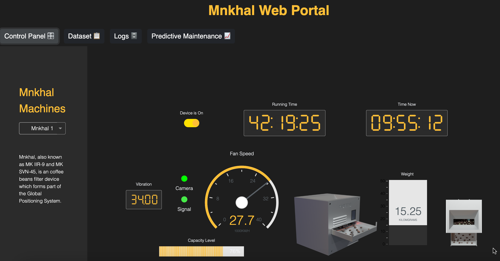

# Mnkhal Portal,

The coffee bean filter, designed for high precision, is an advanced machine that detects impurities such as stones, leaves, and dust in coffee beans. Utilizing cutting-edge technology, this filter ensures that only the purest beans make it through. It operates by scanning the beans as they pass through, identifying and removing any foreign particles with pinpoint accuracy. The system is robust and reliable, built to handle large quantities of beans while maintaining high standards of quality and safety. This innovation marks a significant step forward in coffee processing, ensuring a superior product for consumers
[documentation](https://dash.plot.ly/).

## About the app

Mnkhal, also known as MK IIR-9 and MK SVN-45, is an coffee beans filter device which forms part of the Global Positioning System.

## Screenshots



## Getting Started

### Running the app locally

First create a virtual environment with conda or venv inside a temp folder, then activate it.

```
virtualenv venv

# Windows
venv\Scripts\activate
# Or Linux
source venv/bin/activate

```

Clone the git repo, then install the requirements with pip

```

git clone https://github.com/kamelth/mnkhal-portal.git
cd mnkhal-portal
pip install -r requirements.txt

```

Run the app

```

python app.py

```

